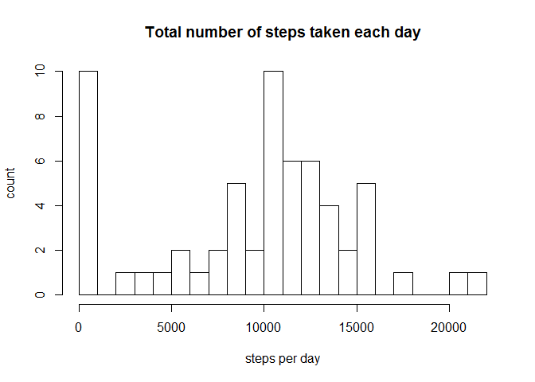
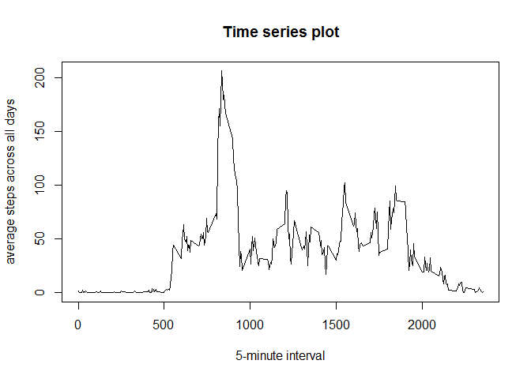
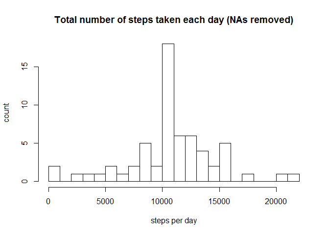
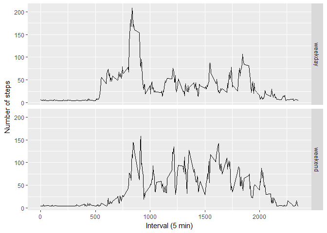

# Analyzing activity monitoring data
mmhuss  
6 Dezember 2017  


---

#### First step: Loading the data

The data is read into R from the local directory by using the read.csv() function.  


```r
activity <- read.csv("./data/activity.csv", header = T)
```
--- 
 
#### Second step: Calculate the mean total number of steps taken per day

First, the total number of the steps taken per day is calculated and a histogram showing the result is made. Then, the mean and median of the steps taken per day is computed. 


```r
steps_day <- tapply(activity$steps, activity$date, sum, na.rm = T)

hist(steps_day, breaks = 20, xlab = "steps per day", ylab = "count", main = "Total number of steps taken each day")
```

<!-- -->

```r
steps_mean <- mean(steps_day)
steps_median <- median(steps_day)
```

The total number of steps taken each day is on average 9354.23. The median is 10395.  

---

#### Third step: Determine the average daily activity pattern

To determine the average daily activity pattern, a time series plot of the 5-minute interval (x-axis) and the average number of steps taken, averaged across all days (y-axis) is made.


```r
steps_int <- tapply(activity$steps, activity$interval, mean, na.rm = T)

plot(activity$interval[1:288], steps_int, type = "l", xlab = "5-minute interval", ylab = "average steps across all days", main = "Time series plot")
```

<!-- -->


```r
max_steps <- which(steps_int == max(steps_int), arr.ind = T)
```

The 5-minute interval **835** contains on average across all days the maximum number of steps.

---

#### Fourth step: Imputing missing values


```r
na_values <- sum(!complete.cases(activity))
```

There is a total number of 2304 rows with missing values in the dataset.  


```r
library(Hmisc)
```


```r
activity_new <- activity
activity_new$steps <- impute(activity$steps, mean)

steps_day_new <- tapply(activity_new$steps, activity_new$date, sum)
hist(steps_day_new, breaks = 20, xlab = "steps per day", ylab = "count", main = "Total number of steps taken each day (NAs removed)")
```

<!-- -->


```r
steps_mean_new <- mean(steps_day_new)
steps_median_new <- median(steps_day_new)
```

After removing the NAs, the mean of the total number of steps taken each day is 1.0766189\times 10^{4} and the median is 1.0766189\times 10^{4}. 

---

#### Fifth step: Look for differences in activity patterns between weekdays and weekends

For this analysis a new factor variable is created, which indicates whether a given date is a weekday or weekend day. Then a panel plot is made to make possible differences visually detectable.


```r
activity_new$wday <- factor(ifelse(weekdays(as.POSIXlt(activity_new$date)) %in% c("Samstag", "Sonntag"), "weekend", "weekday"))
```


```r
steps_agg <- aggregate(steps ~ interval + wday, mean, data = activity_new)

library(ggplot2)
g <- ggplot(steps_agg, aes(interval, steps)) + geom_line() + facet_grid(wday ~.) + xlab("Interval (5 min)") + ylab("Number of steps")
g
```

<!-- -->
